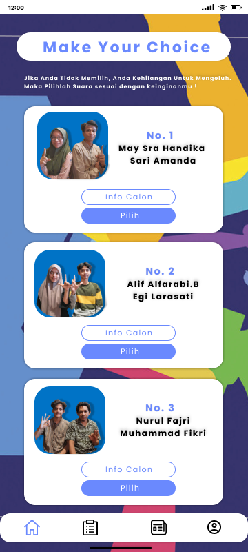

# Mobile Voting App for Elections (POLL APP)

## Introduction

Welcome to POLL APP the Mobile Voting App for Elections! This Android
application aims to provide a secure, reliable, and user-friendly platform for
voting in elections. The app includes various features to keep users informed,
authenticated, and able to participate in the voting process efficiently.

## Features

-   **News**: Stay updated with the latest election news, notifications, and
    updates.
-   **Authentication**: Secure user authentication to ensure only eligible
    voters can access the voting system.
-   **Voting**: Cast your vote for your preferred candidates in the elections.
-   **Election Results**: View real-time election results as soon as the voting
    period ends.

## Screenshots

Here is some screenshots, to get more click screenshots folder.

### Login


### Home


### Votting



### Result


### About US


## Installation

To get a local copy up and running, follow these simple steps:

1. **Clone the repository**:
    ```sh
    git clone https://github.com/abdullahfikri/pollapp.git
    ```
2. **Open the project in Android Studio**.
3. **Build the project** and run it on an emulator or physical device.

## Usage

1. **Authentication**: Users must sign up or log in to access the app.
2. **News**: Users can browse through the latest news related to the elections.
3. **Voting**: Once authenticated, users can cast their votes during the
   election period.
4. **Results**: After the voting period, users can view the results in
   real-time.

## Team Members

-   **Muhammad Fikri**: Project Manager and Backend Programmer
-   **Egi Larasati**: Graphic Designer (Figma)
-   **Alif Alfarabi B**: Graphic Designer (Figma)
-   **Sari Amanda Putri**: Layout XML and Database Developer
-   **Nurul Fajri**: XML Layout Developer
-   **May Sra Handika**: XML Layout Developer

## Contact

-   Muhammad Fikri - [mfikri.dev@gmail.com](mailto:mfikri.dev@gmail.com)
-   Alif Alfarabi. B -
    [alifalfarabiyt@gmail.com](mailto:alifalfarabiyt@gmail.com)

Project Link:

-   [https://github.com/abdullahfikri/pollapp.git](https://github.com/abdullahfikri/pollapp.git)
-   [https://github.com/abdullahfikri/votingapp_init.git](https://github.com/abdullahfikri/votingapp_init.git)

## Acknowledgments

-   Thank you to all contributors and users who have supported this project.
-   Special thanks to Sir Nazruddin Safaat H., S.T., M.T. as Lecturer at Mobile
    App Class UIN Suska Riau.
